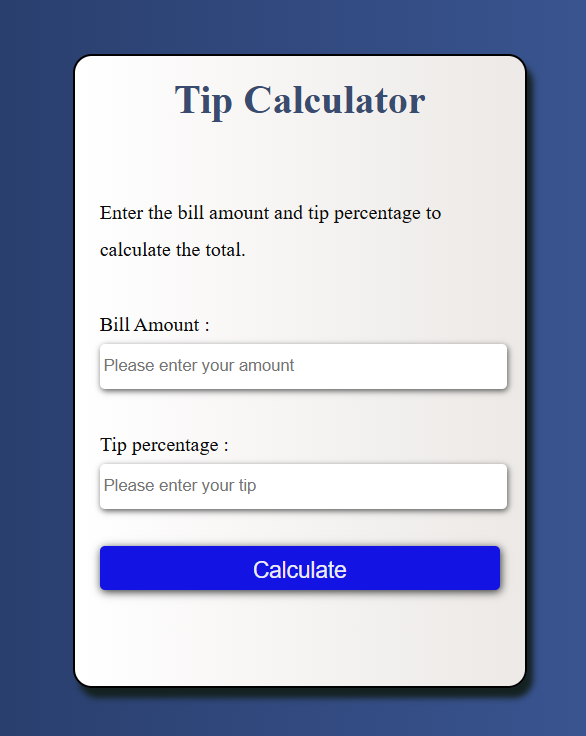

# 💰 Tip Calculator  

A simple and interactive **Tip Calculator** built using **HTML, CSS, and JavaScript**.  
This project helps users quickly calculate the tip amount and total bill per person.  

---

## 🚀 Features  
- Enter bill amount and tip percentage.  
- Instantly calculate the tip.  
- Display the final amount (bill + tip).  
- Clean and minimal UI.  
- Beginner-friendly JavaScript project.  

---

## 🛠️ Tech Stack  
- **HTML5** – Structure  
- **CSS3** – Styling  
- **JavaScript (ES6)** – Logic & Interactivity  

---

## 📸 Preview  
  
 

---

